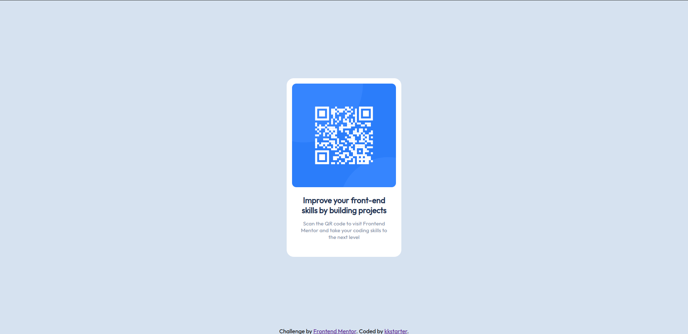

# Frontend Mentor - QR code component solution

This is a solution to the [QR code component challenge on Frontend Mentor](https://www.frontendmentor.io/challenges/qr-code-component-iux_sIO_H). Frontend Mentor challenges help you improve your coding skills by building realistic projects. 

## Table of contents

- [Overview](#overview)
  - [Screenshot](#screenshot)
  - [Links](#links)
- [My process](#my-process)
  - [Built with](#built-with)
  - [What I learned](#what-i-learned)
  - [Useful resources](#useful-resources)
- [Author](#author)

## Overview

### Screenshot

### Links

- Solution URL: [https://github.com/kkstarter/mentor_qr]
- Live Site URL: [https://kkstarter.github.io/mentor_qr/]

## My process

### Built with

- HTML/CSS
- SASS (SCSS)

### What I learned

Probably nothing new, just remember basics.

### Useful resources

- [MDN](https://developer.mozilla.org/en-US/)
- [SASS](https://sass-lang.com/)

## Author

- GitHub - [kkstarter](https://github.com/kkstarter)
- Frontend Mentor - [@kkstarter](https://www.frontendmentor.io/profile/kkstarter)
